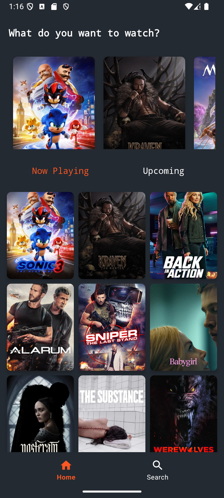
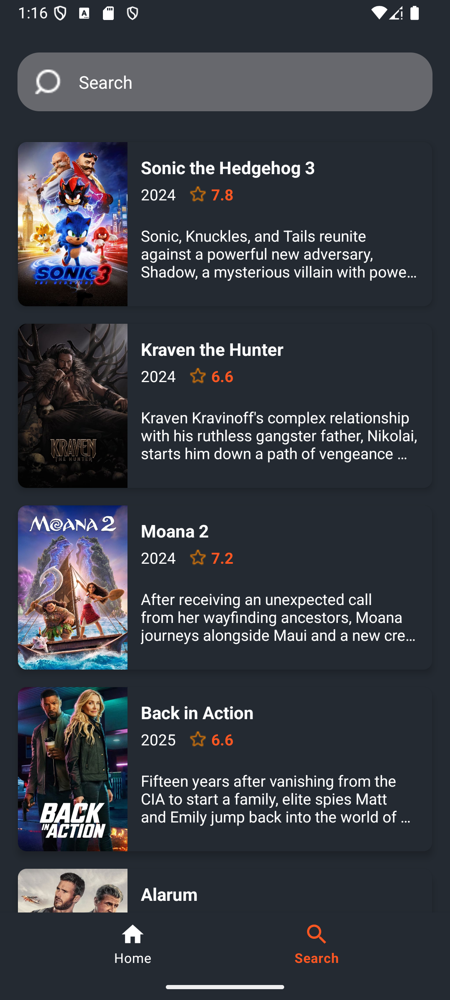
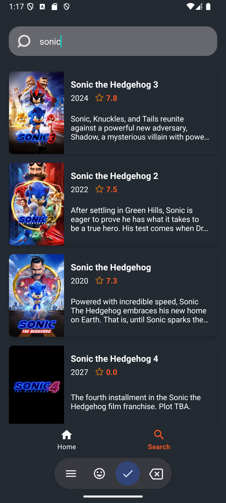
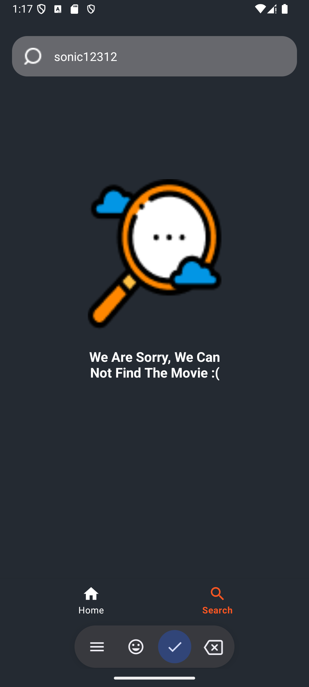
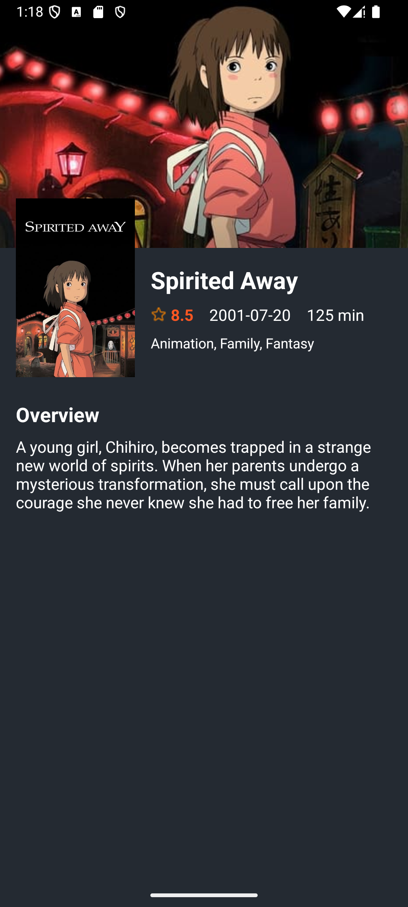

# Movies App 🎬

A modern Android application that helps users discover movies using TMDB API. Users can browse popular movies, search for specific titles, and view detailed information about each movie.

## Screenshots 📱
<table>
  <tr>
    <td align="center"><strong>Home Screen</strong></td>
    <td align="center"><strong>Search Screen</strong></td>
    <td align="center"><strong>Search Results</strong></td>
    <td align="center"><strong>No Results Found</strong></td>
    <td align="center"><strong>Details Screen</strong></td>
  </tr>
  <tr>
    <td></td>
    <td></td>
    <td></td>
    <td></td>
    <td></td>
  </tr>
</table>

- Home Screen: Shows popular, now playing, and upcoming movies
- Search Screen: Allows users to search for movies
- Detail Screen: Displays detailed information about a selected movie

## Features 🌟

- Browse popular movies
- View now playing movies
- Discover upcoming movies
- Search movies by title
- View detailed movie information including:
  - Movie poster and backdrop
  - Title and release date
  - Rating
  - Runtime
  - Genres
  - Overview

## Tech Stack 🛠️

- **Architecture Pattern**
  - MVVM (Model-View-ViewModel)
  - Clean Architecture
  - Repository Pattern

- **Android Components**
  - View Binding
  - Navigation Component
  - ViewModel
  - LiveData
  - Coroutines for asynchronous operations

- **Dependency Injection**
  - Hilt

- **Network**
  - Retrofit for API calls
  - OkHttp for HTTP client
  - GSON for JSON parsing

- **Image Loading**
  - Glide

- **Other Libraries**
  - Material Design Components
  - ConstraintLayout for responsive UI
  - RecyclerView for list displays

## Architecture 🏗️

The app follows Clean Architecture principles with the following layers:

- **Presentation Layer (UI)**
  - Activities/Fragments
  - ViewModels
  - Adapters

- **Domain Layer**
  - Use Cases
  - Repository Interfaces
  - Models

- **Data Layer**
  - Repository Implementations
  - Remote Data Source
  - API Service

## Getting Started 🚀

1. Clone the repository
```bash
git clone https://github.com/cevizenes/MoviesApp.git
```

2. Open the project in Android Studio

3. Get an API key from [TMDB](https://www.themoviedb.org/documentation/api)

4. Add your API key in `MoviesApiService.kt`
```kotlin
const val API_KEY = "YOUR_API_KEY"
```

5. Build and run the project


## Acknowledgments 👏

- [TMDB](https://www.themoviedb.org/) for providing the movie data API
- Material Design for the UI components
- All the awesome library authors


Project Link: [https://github.com/cevizenes/MoviesApp](https://github.com/cevizenes/MoviesApp) 
